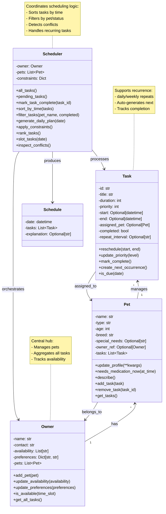

# PawPal+ Final UML Diagram

## Key Enhancements from Phase 1 to Final Implementation

### New Attributes Added
- **Task**: `repeat_interval` (for daily/weekly recurrence)
- **Task**: `end` datetime (for conflict detection window)

### New Methods Added
- **Task**: `create_next_occurrence()` (auto-schedule repeats)
- **Task**: `is_due(date)` (date filtering)
- **Scheduler**: `sort_by_time(tasks)` (algorithmic sorting)
- **Scheduler**: `filter_tasks(pet_name, completed)` (filtering logic)
- **Scheduler**: `mark_task_complete(task_id)` (with recurrence automation)
- **Scheduler**: `inspect_conflicts()` (lightweight conflict detection)

### Relationship Changes
- Task now maintains back-reference to assigned Pet
- Pet maintains reference to Owner for bidirectional lookup
- Scheduler created as separate orchestration class (not mixed with Owner)
- Schedule dataclass created as explicit output type

### Architecture Insights
- **Separation of Concerns**: Scheduler is separate from Owner/Pet data classes
- **Recurrence Automation**: Tasks auto-create next occurrence on completion
- **Conflict Reporting**: Non-blocking warnings (not exceptions)
- **Filtering Support**: Query tasks by pet, completion status, or both
